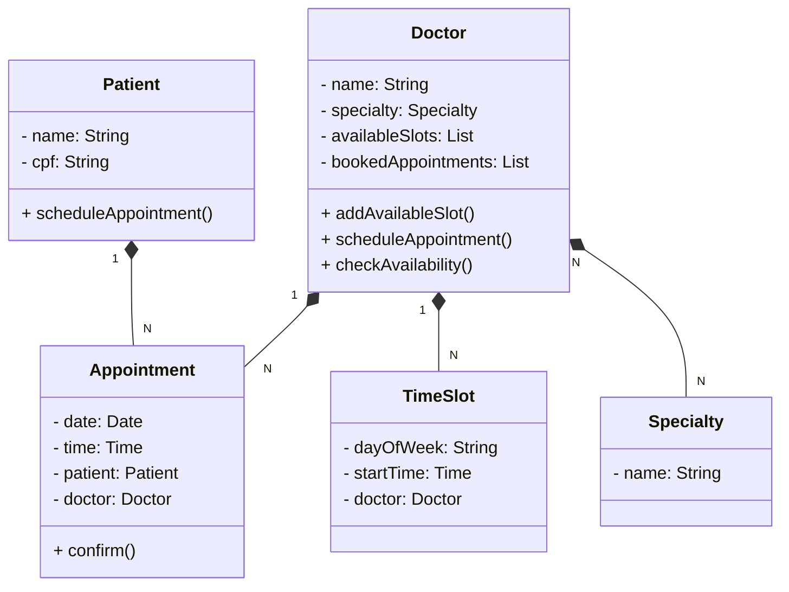

# Bootcamp Desenvolvimento Java com IA
Java RESTful API criada para Bootcamp Desenvolvimento Java com IA.

## Diagrama de Classes

```mermaid
classDiagram
    class Patient {
        - name: String
        - cpf: String
        + scheduleAppointment()
    }

    class Doctor {
        - name: String
        - specialty: Specialty
        - availableSlots: List<TimeSlot>
        - bookedAppointments: List<Appointment>
        + addAvailableSlot()
        + scheduleAppointment()
        + checkAvailability()
    }

    class Specialty {
        - name: String
    }

    class Appointment {
        - date: Date
        - time: Time
        - patient: Patient
        - doctor: Doctor
        + confirm()
    }

    class TimeSlot {
        - dayOfWeek: String
        - startTime: Time
        - doctor: Doctor
    }

    Patient "1" *-- "N" Appointment
    Doctor "1" *-- "N" Appointment
    Doctor "1" *-- "N" TimeSlot
    Doctor "N" *-- "N" Specialty
```
